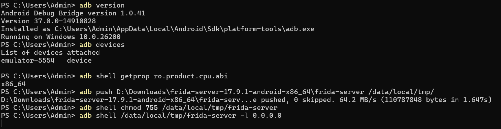
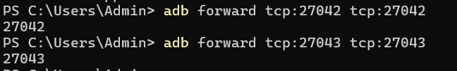
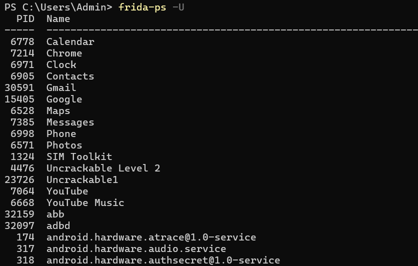
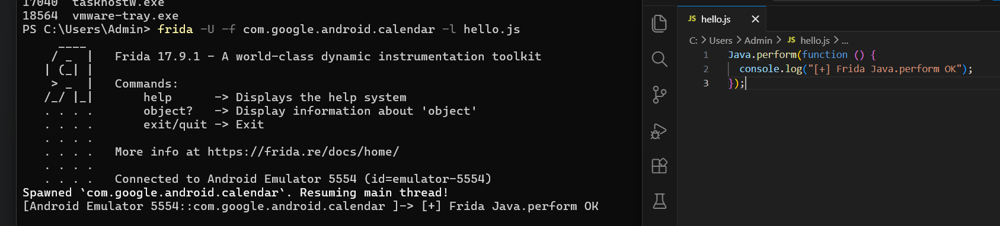
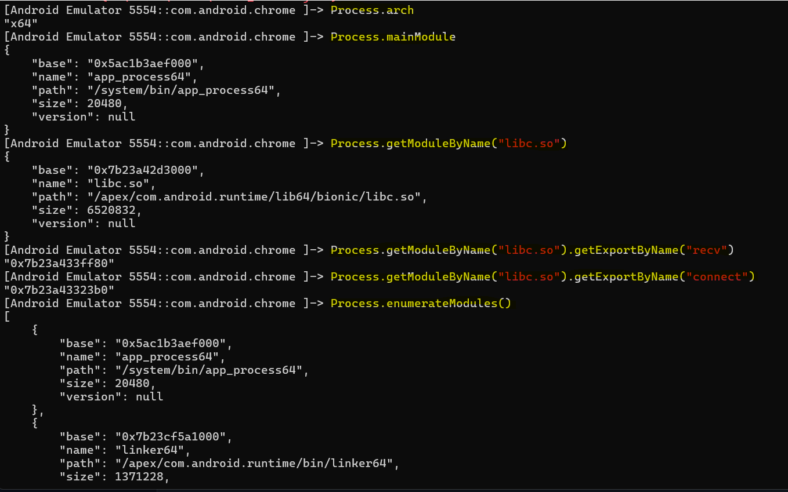
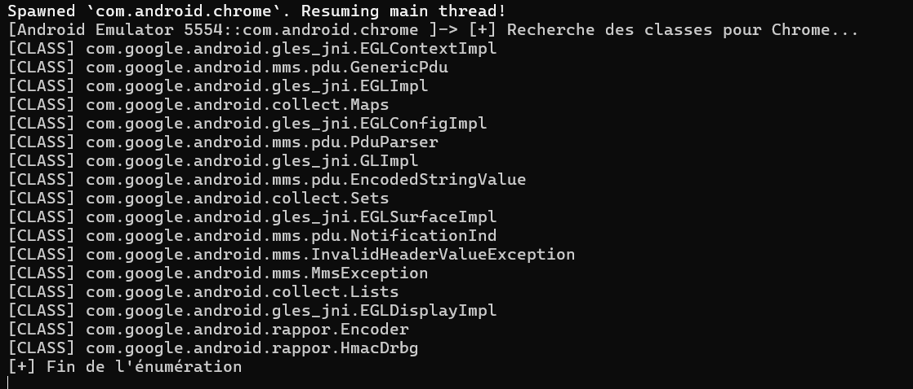

# Instrumentation Dynamique Android avec Frida

Ce laboratoire documente l'utilisation de **Frida** pour l'analyse dynamique d'applications Android. L'objectif est de maîtriser l'injection de code (hooking) pour observer et modifier le comportement des applications en temps réel.

## 📌 1. Installation et Preuves de Fonctionnement

La première étape consiste à préparer l'environnement client (PC) et à vérifier la connectivité avec l'appareil Android via ADB.

### 1.1 Vérification de l'environnement (PC)
Les outils `frida-tools` et `adb` doivent être correctement installés et accessibles dans le PATH.

### 1.2 Identification de l'architecture
Avant de déployer le serveur, nous identifions l'architecture CPU de l'appareil pour choisir le bon binaire.
*   **Commande :** `adb shell getprop ro.product.cpu.abi`

---

## 🛠️ 2. Déploiement et Configuration du Serveur

### 2.1 Transfert et Exécution
Le binaire `frida-server` est transféré dans un répertoire temporaire, rendu exécutable, puis lancé avec les privilèges root.

### 2.2 Redirection de ports (Port Forwarding)
Pour que les outils Frida sur le PC communiquent avec le serveur sur l'appareil, nous configurons la redirection des ports TCP 27042 et 27043.

---

## 🔍 3. Analyse Dynamique et Injection

### 3.1 Énumération des processus
Une fois le lien établi, nous listons les processus et applications installées pour identifier nos cibles d'audit.
*   **Commande :** `frida-ps -U`

### 3.2 Injection de script (Validation Java)
Nous utilisons un script minimal `hello.js` pour confirmer que Frida peut s'attacher à la machine virtuelle.

---

## 🛡️ 4. Exploration Avancée (Console Interactive)

La console interactive permet d'effectuer une reconnaissance approfondie du processus cible (ici `com.android.chrome`).

### 4.1 Reconnaissance Native
Nous inspectons les modules chargés et les fonctions système critiques (libc) pour préparer des hooks réseau.

### 4.2 Énumération des classes Java
Pour l'analyse de sécurité, nous listons les classes chargées afin de repérer les composants sensibles liés au stockage ou au chiffrement.

---

## ⚠️ 5. Remise à zéro
À la fin de la séance, le processus serveur est arrêté et les fichiers temporaires sont nettoyés pour éviter toute persistance non désirée sur l'appareil de test.
